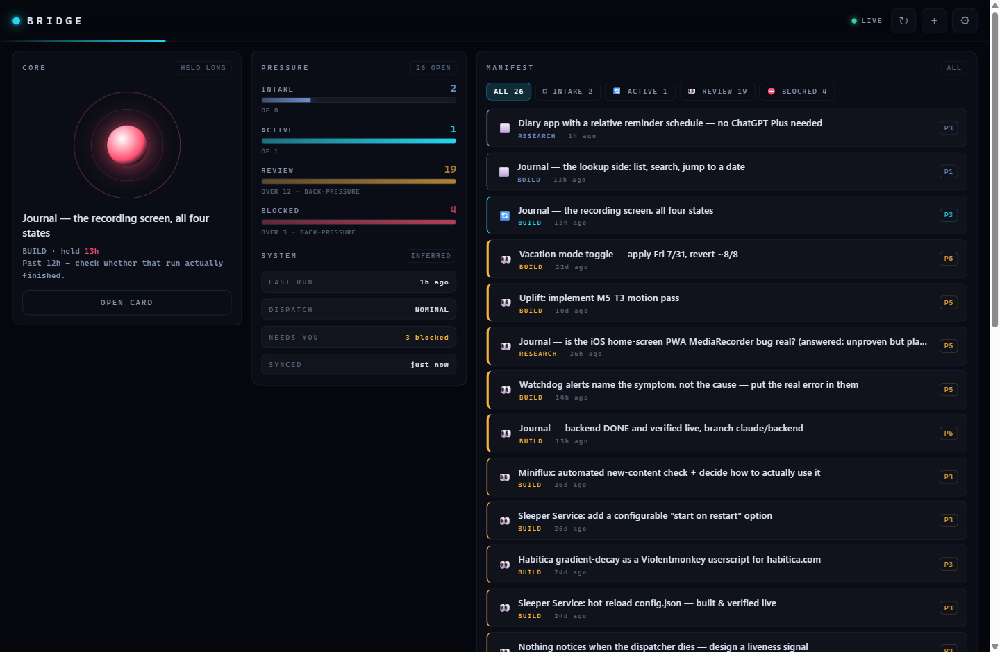
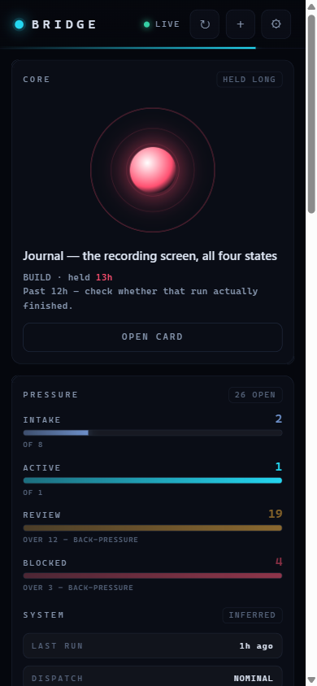
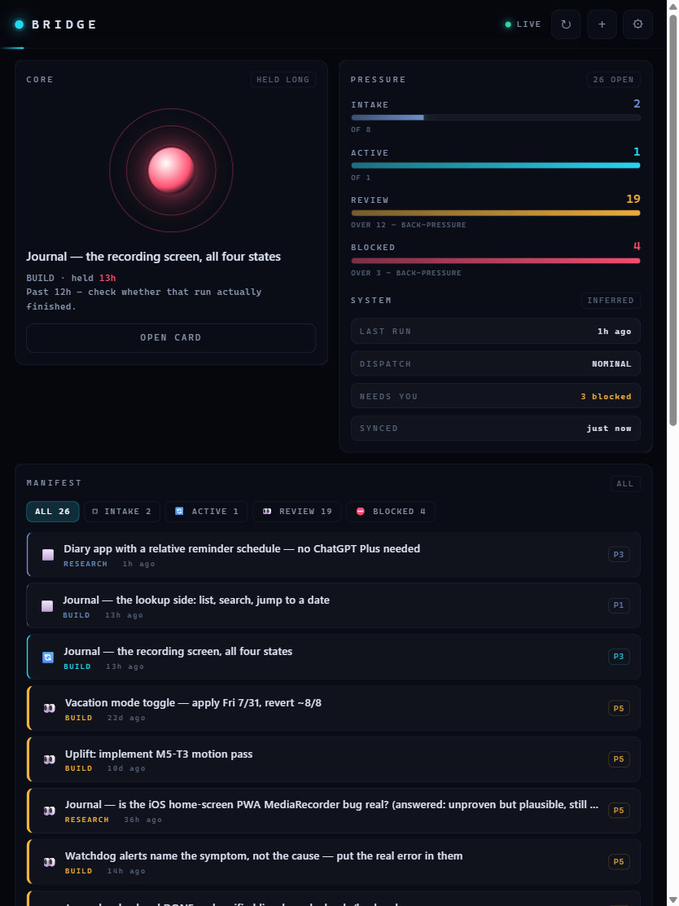

# Bridge

A live console for the **Claude Queue** board — what a run is holding right now, what is
backing up, what is blocked on Chris. Standalone PWA: desktop, Android, iPad.

Named for a ship's bridge, which is what it is: the place you stand to see the whole vessel
and give it orders. (Sleeper Service is the ship.)



---

## Why this can exist at all

`ECOSYSTEM.md` G4 says nothing can reach this system from off-machine, and G6 says a published
view can only ever be a snapshot because TickTick here is a *local stdio MCP server*.

Both are true of the **dispatcher**. Neither is true of the **board**. The Claude Queue lives in
TickTick's cloud, and the TickTick Open API answers:

```
Access-Control-Allow-Origin: *
Access-Control-Allow-Headers: authorization, content-type
Access-Control-Allow-Methods: GET,HEAD,POST,PUT,PATCH,DELETE,OPTIONS
```

— verified, on both the GET and the POST preflight. So a static page can read *and write* the
board directly from any browser, on any device, with no server and no proxy. Babel already
relies on the same fact for its POSTs.

That makes Bridge genuinely live, not a regenerated snapshot. It is the first view of this
system that is.

**What it still cannot do:** reach Sleeper Service. It cannot start a run, stop one, or read
`state.json` — those are local files, and G4 stands. Its `SYSTEM` panel is labelled `INFERRED`
for that reason (see below).

---

## What the display encodes

Standing rule: every visual property carries data. Nothing here animates for atmosphere.

| Element | Encodes |
|---|---|
| Core ring **pulse speed** | staleness of the claimed card — slower as it ages |
| Core **colour** | claim age crossing 6h (amber) and 12h (red) |
| Core **still and dim** | nothing claimed; a motionless console means no run is holding work |
| Gauge **fill** | count against that lane's expected ceiling |
| Gauge **throb** | lane is over its ceiling — real back-pressure |
| Row **left-edge thickness** | pick order (P5 thickest — it goes first) |
| Row **beacon** | a blocked card, pulsing faster the longer it has gone unanswered |
| **Sweep bar** under the header | time remaining until the next poll |

The beacon deliberately skips cards whose body contains `--- PARKED`. The playbook parks cards
on purpose and says not to keep surfacing them; a console that nags about a decision Chris
already made is a console he stops trusting.

### `SYSTEM` is inferred, and says so

Bridge cannot see the dispatcher. It infers "did a run happen" from the age of the newest
`☀️`/`📋` card on the board — which is exactly check (b) the watchdog uses. It is labelled
`INFERRED` in the UI on purpose: per G8, a health light that lies is worse than no light.

### Manifest vs. ship's log

Cards in the **Queued / Working / Needs Review / Blocked** columns are work, and get the
manifest. Cards in **Done**, plus anything prefixed `☀️ 📋 ✅ ✔️ 🚨` that sits in no column, are
the system talking about itself or finished with, and get the collapsed log. Without that
split, 16 daily digests bury the one card that needs a decision.

Cards with **no `columnId` at all** — every report/triage/alarm card a run posts — fall back to
the emoji prefix. A card in **Not Sectioned** falls back too: that is TickTick's default bucket,
so a card dragged there is *unfiled*, not *stateless*, and dropping it off the console would be
the wrong kind of quiet. Absent and unfiled are handled as separate cases in `classify()`.

---

## Writing to the board

Full control except delete. State, pick order, append-a-note, replace-body, complete, create.

State lives in the **kanban column**. ECOSYSTEM.md used to carry a fragility, F4, saying
"the Open API can't write tags or columns". That entry was **deleted on 2026-09-04** because it
is false in both directions, so do not go looking for it.

For columns, probed 2026-08-25 against `api.ticktick.com/open/v1`, the same surface this app
talks to: a partial POST sets `columnId` and TickTick resolves `columnName` from it; a partial
POST moves a card between columns; and a title-only POST leaves an existing `columnId` alone.
For tags, `automation/ticktick_api.py add_tags()` writes them and reads them back. The original
claim was true only of the old local stdio MCP wrapper, which returned 200 and silently dropped
both — a result about one client, written down as a property of the API.

That last result is what made the old prefix-only design worse than it looked. Rewriting just
the title never *ejected* a card from its column — it left the column **stale**, so the board's
two encodings drifted apart with nothing on screen saying so.

The board is **dual-encoded** for now: bridge writes the column *and* the legacy emoji prefix,
both fields in **one** partial POST, so they land together or fail together and can never
disagree. The prefix rewrite still strips the old glyph rather than blind-prepending. Because
`verify()` strict-compares every field it sent, including `columnId`, each state tap doubles as
a live probe — if TickTick ever starts dropping `columnId` the way it drops tags, bridge says so
on screen instead of rotting quietly.

`DUAL_ENCODE` in `app.js` turns the prefix half off. **Leave it `true`** until the dispatcher,
triage and `expire_reports` stop reading the prefix; the read side already ignores the prefix
whenever a column is present, so nothing else changes when that day comes.

Every write follows the discipline in `automation/ticktick_api.py`, for the reasons its
docstring gives:

- **Partial POST.** `{id, projectId, ...changed}` only. TickTick merges scalar fields but
  *replaces list fields wholesale*, so `tags` is never sent from here. Posting a whole task
  object back is the naive move that silently eats tags.
- **Read-then-append.** Card bodies are shared memory between Chris and every run. Appends read
  current content first; the OUTCOME trail is never overwritten.
- **A 200 proves nothing.** Every write re-`GET`s the task and confirms the value actually
  stored, and reports a real failure when it did not. Completion verifies *by absence* from the
  open-task list.
- **Local timestamps.** Appended notes stamp local time with the zone (`2026-08-19 09:06 CDT`)
  to match how everything else writing to these cards stamps. A UTC stamp would misorder the
  trail for whoever reads it next.

Delete is not implemented, deliberately.

---

## Running it

```bash
python -m http.server 3008
```

or `preview_start bridge` (registered in `.claude/launch.json`, port 3008).

First load asks for the TickTick Open API token — the same one in
`SleeperService/config.json` → `ticktick_token`. It is stored in that browser's `localStorage`,
sent only to `api.ticktick.com`, and never leaves the device otherwise. The token is validated
against the API before it is stored.

For local development, `python dev-token.py` writes a gitignored `_dev.html` that seeds the
token so you skip the setup screen; `python dev-token.py --clean` removes it.

`python make_icons.py` regenerates the PWA icons.

### Installing on phone / iPad

Live at **https://mrsuperchris.github.io/bridge/**

On iPad, open it in **Safari** (not Chrome — Add to Home Screen is a Safari feature on iPadOS),
then Share → Add to Home Screen.

On Android, open it in Chrome, then ⋮ → **"Install and create shortcut"**, and choose **Install**
when offered. Chrome renamed this menu item; it used to read "Add to Home screen", which is what
this README said until 2026-09-12, and the old wording sent Chris hunting for an option that no
longer exists. Take Install rather than a plain shortcut — the manifest declares
`"display": "standalone"`, so installing gives a real app window, while a shortcut is just a
bookmark that opens a Chrome tab.

Either way it runs standalone with its own icon.

Paste the token once per device — but do not type it by hand. `python qr-setup.py` renders a QR
that carries the token in the URL fragment; scan it with the device camera and Bridge configures
itself. Run `python qr-setup.py --clean` afterwards, because the generated PNG contains a live
credential. If you do need the raw token:

```powershell
(Get-Content C:/Users/Chris/claude/SleeperService/config.json -Raw | ConvertFrom-Json).ticktick_token
```

### Security posture

- **The repo is public and contains no secrets.** The token is gitignored and lives only in each
  device's `localStorage`. A stranger who finds the URL gets the setup screen and nothing else.
- **Origin is shared.** GitHub Pages serves every repo from `mrsuperchris.github.io`, and
  `localStorage` is scoped per *origin*, not per path — so this token shares a jar with Babel,
  I Ching and Tachometer. Babel already stores the same token there, so this is not new exposure,
  but one compromised dependency in any of those apps would reach it.
- **Blast radius if it leaks:** read/write on TickTick tasks only. Regenerate the token in
  TickTick's developer console to revoke it instantly.
- Card bodies are escaped including quotes — see the XSS note in the commit history; card text
  is not all hand-written, so it is treated as untrusted.

The service worker caches **only the app shell** — never board data. A cached queue displayed as
though it were live is precisely the stale-indicator failure G8 is about.

---

## Screens

| | |
|---|---|
|  |  |
